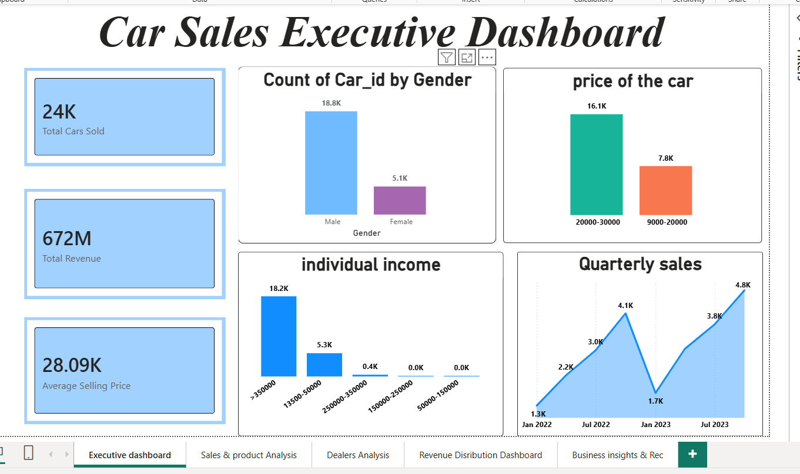
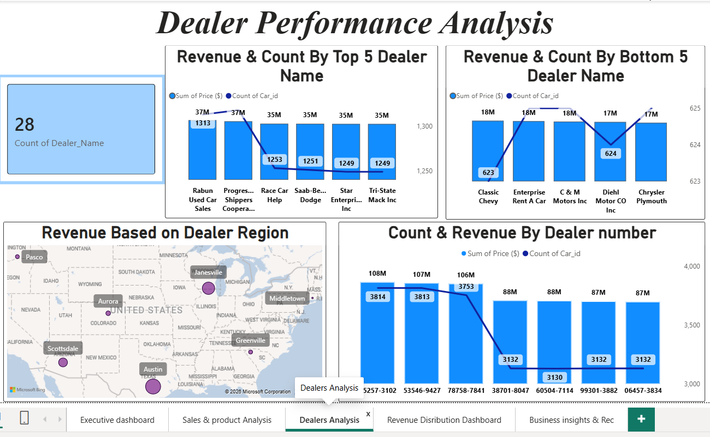
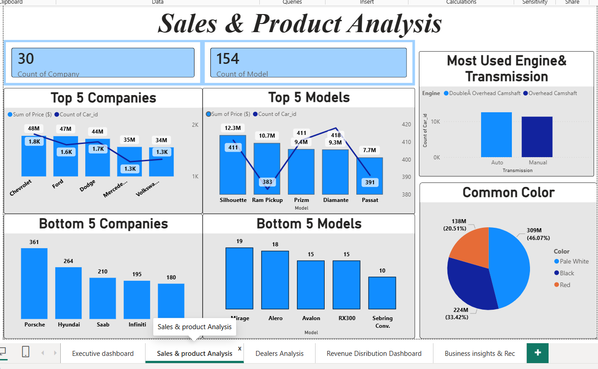
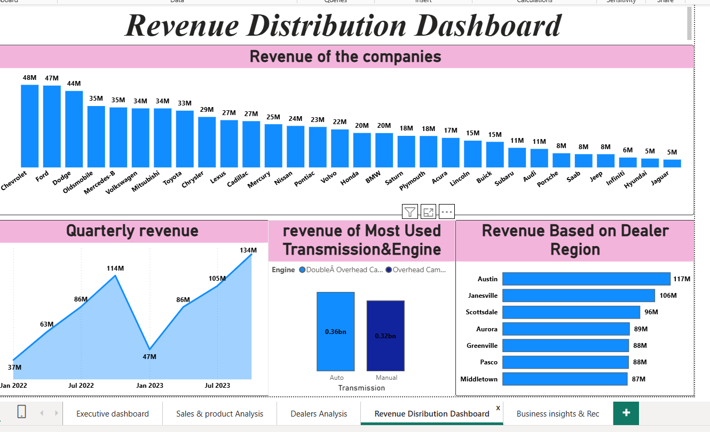
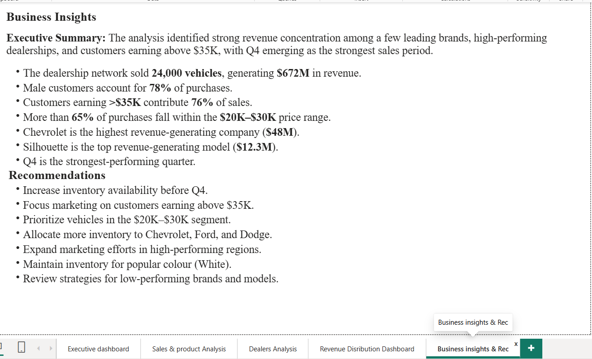

Car Sales Performance Dashboard (Power BI):
📌 Project Overview :

This Power BI dashboard analyzes automotive sales data to provide insights into customer behavior, vehicle performance, revenue trends, and dealership operations. The dashboard enables stakeholders to monitor key business metrics, identify growth opportunities, and support data-driven decision-making.

📸 Dashboard Preview:

Executive Summary

Dealer Performance Analysis

Sales & Product Analysis

Revenue Distribution

Business Insights & Recommendations

💡 Key Business Insights:

The dealership network sold 24,000 vehicles, generating $672M in revenue.
Male customers account for 78% of purchases.
Customers earning >$35K contribute 76% of sales.
More than 65% of purchases fall within the $20K–$30K price range.
Chevrolet is the highest revenue-generating company ($48M).
Silhouette is the top revenue-generating model ($12.3M).
Q4 is the strongest-performing quarter.

🎯 Recommendations:

Increase inventory availability before Q4.
Focus marketing on customers earning above $35K.
Prioritize vehicles in the $20K–$30K segment.
Allocate more inventory to Chevrolet, Ford, and Dodge.
Expand marketing efforts in high-performing regions.
Maintain inventory for popular colour (White).
Review strategies for low-performing brands and models.

🚀 Skills Demonstrated:

- Data Cleaning & Transformation
- DAX Measures 
- Business Intelligence Reporting
- Data Visualization
- Dashboard Design
- Sales Analytics
- Business Insights Generation
- Strategic Decision-Making Support
  
 🛠️ Tools & Technologies:

- Power BI Desktop
- Power Query
- DAX
- Data Modeling (Star Schema)
- Excel/CSV Dataset

   📈 Project Outcome:
  
The dashboard provides a centralized view of dealership performance, customer purchasing behavior, vehicle sales trends, and revenue distribution. It helps business stakeholders identify high-performing products, optimize inventory planning, improve marketing strategies, and support revenue growth initiatives.
